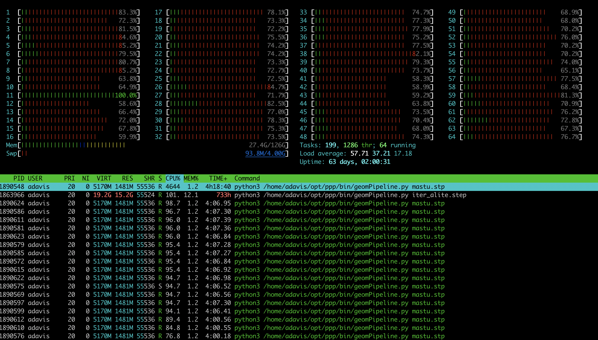

**Parallel-preprocessor: a prototype of parallel CAE geometry preprocessing framework**

by Qingfeng Xia  
Research Software Engineering Group of UKAEA  
License: LGPL v2.1  
Copyright UKAEA, 2019~2020  

[**Documentation pages (including this Readme)**](https://ukaea.github.io/parallel-preprocessor/site/doxygen-docs.html)

## Feature overview

Currently, this software provides multi-threading geometry imprint and collision check, via command line user interface. This software has demonstrated faster and more controllable geometry **collision-detection, imprinting** on **large geometry assemblies (10k+ parts)** that is not possible on most existing CAD tools.

This software aims to be a framework for more CAE/CAE **preprocessing operatons** for large geometry assemblies upto 1 million parts, such as fusion reactor, aeroplane, aero-engine as a whole, using high performance computation  infrastructure like Exa-scale super-computer. see more [Technical Overview](./wiki/TechOverview.md) on why a parallel preprocessor is needed in the era of E-scale (10^18 FLops) computation.

Screenshot for the CPU usage of parallel-preprocessor using 64 threads on a 32-core CPU (Source: Dr Andy Davis)

## Get started (tutorial)

[wiki/GetStarted.md](wiki/GetStarted.md): quick started guide to use geometry processing pipeline

## Future plan

[wiki/Roadmap.md](wiki/Roadmap.md): lists short-term and long-term plan, depends on funding status. Partially sponsoring this project is welcomed to enhance existing modules or develop new modules.

## Disclaimer

This is **NOT** a production quality software, but a prototype to demonstrate the potential of accelereating CAE preprocessing by massive-parallel on HPC. We would like to apply more good practice in research software engineering, once resource is available.

According to the open source [license](./LICENSE),  **there is no warranty for this free library**

## Platforms supported

This project has been designed to be cross-platform, but only Linux is supported as the baseline platform.

+ Ubuntu latest LTS as the primary/baseline development platform, with deb binary package generated 
    - Debian package should be achievable, since OpenCASCADE are available in official repository

+ Fedora 30+  with OpenCascade 7.x package available from official repository, have rpm binary package generated.

+ Compiling from source code for other Linux platforms is straight-forward,  driven by cmake and cpack, guidance provided. 
    - Centos8 should work without much effort, but OpenCASCADE must be compiled from source at first.
    - Centos7 software stack is outdated for compiler and cmake , using docker/singularity instead.

+ Windows 10 users are encouraged to use WSL with one of the supported Linux distributions, while guide to compile on Windows has been added.

+ MacOS compiling and packaging is done via homebrew, DragNDrop binary package is available.

Conda package and Linux native package for Ubuntu LTS may be available in the future, see [packaging.md](wiki/Packaging.md)

## Installation guide

**Note: user must install runtime dependencies (TBB, OpenCASCADE, etc, see Compile guide wiki pages for each platform) then install the downloaded binary package. Hint: if user have freecad installed, then all dependencies should have installed**

### Download (x86_64 architecture) binary packages
Ubuntu deb package and fedora 30+ rpm package, conda packages for windows, it should be available to download on **github Release** for this public github. The unstable package build from the latest code on the main branch can be downloaded here <https://github.com/ukaea/parallel-preprocessor/releases/tag/dev>

**Note: choose the correct operation system, and the package is targeting at system-wide python3**

The package file has the name pattern: `parallel-preprocessor-<this_software_version>-dev_<OS name>-<OS version>.<package_suffix>` If your OS is not supported, you need to compile it by yourself,  there is documentation for installation dependency and build for all major platforms.

All the latest binary packages (built on each push/merge of the main branch) can be downloaded from
https://github.com/ukaea/parallel-preprocessor/releases

For Ubuntu and Debian: 
remove the older version by `sudo apt remove parallel-preprocessor`, and install the downloaded
`sudo dpkg -i parallel-preprocessor*.deb`

For Fedora:
remove the older version by `sudo dnf remove parallel-preprocessor`
`sudo rpm -ivh parallel-preprocessor*.rpm` or double click to bring up package installer.

 Coming soon: parallel-preprocessor dmg package for MacOS 10.15

 Coming later:   Conda package for Windows 10.

### Test the installation

[wiki/Testing.md](wiki/Testing.md): unit test and integration tests written in Python. User can validate the software building and installation by run some of the test cases.

---

## [Developer document and guide] (./DeveloperGuide.md)

+ compiling and packaging on Linux, MacOS, Windows
+ archicture, parallel, user interface, API, documentation design

---

## Contribution

Please submit issue on gihtub issues, and send in your fix by PR, see more details in [workflow for contribution](./wiki/Contribution.md)

## Acknowledgement

Funding from August 2019 ~ April 2020: STEP project in UKAEA <http://www.ccfe.ac.uk/step.aspx>

Dr Andrew Davis of UKAEA, has contributed his technical insight,  test geometries and other support to this software project. Also thank to my colleagues Dr John Nonweiler, Dr Jonathon Shimwell, etc.  for testing and reviewing this software.